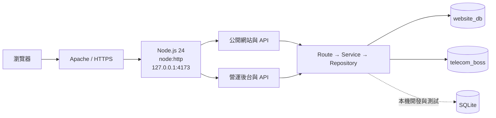

# 電信營運管理系統-Intern｜Telecom Boss App

[](https://nodejs.org/)
[](https://www.mysql.com/)
[](https://www.sqlite.org/)
[](https://nodejs.org/api/esm.html)

資料庫驅動的電信商品官網與營運後台。公開網站提供服務與商品目錄、價格與促銷、方案比較、商品詳情及申裝洽詢；內部後台涵蓋 Catalog V2、客戶、工單、庫存、帳務、報表與通知。

正式環境使用 MySQL 8；本機開發、Migration、Seed 與回歸測試使用 SQLite 相容 adapter。專案以 Node.js 原生能力、Semantic HTML、CSS 與瀏覽器 ES Modules 建置，不使用前端框架。

> [!NOTE]
> 儲存庫只保存程式碼、Migration、測試與文件。Runtime 資料庫、密碼、環境變數、私鑰、備份及部署回復檔案不會提交至 Git。

## 目錄

- [核心功能](#核心功能)
- [系統架構](#系統架構)
- [快速開始](#快速開始)
- [常用指令](#常用指令)
- [正式環境](#正式環境)
- [安全與測試](#安全與測試)
- [專案結構](#專案結構)
- [延伸文件](#延伸文件)

## 核心功能

- 官方首頁、服務入口、商品目錄與獨立商品詳情頁。
- 資料庫驅動的價格、優惠、內容、規格、品牌與安全圖片。
- 可分享分類狀態的商品目錄，以及保留申裝上下文的跨頁流程。
- 響應式方案比較、鍵盤操作與可存取的載入、空白及錯誤狀態。
- 具欄位驗證、頻率限制與持久化冪等的交易式申裝 API。
- Catalog V2 商品／分類、客戶、工單、庫存、帳務及付款管理。
- 權限感知的全域搜尋、報表、通知與唯讀系統健康資訊。
- RBAC、CSRF、版本衝突保護、Transaction 與稽核紀錄。

## 系統架構



| 類別 | 技術 |
|---|---|
| Runtime | Node.js 24、原生 `node:http`、ES Modules |
| Production DB | MySQL 8、`mysql2/promise` Connection Pool |
| Development DB | 原生 `node:sqlite` |
| Frontend | Semantic HTML、CSS、Browser ES Modules |
| Testing | `node:test`、整合測試、安全測試、瀏覽器驗收 |
| Deployment | Apache HTTPS reverse proxy、systemd、loopback port `4173` |

`website_db` 保存站台與中繼資料；`telecom_boss` 保存營運核心與 Catalog V2 資料。完整模組與資料流請見[系統架構](docs/architecture.md)及[系統說明](docs/system-description.md)。

## 快速開始

### 環境需求

- Node.js `24` 以上
- npm、Git
- PowerShell（以下指令以 Windows 為例）

### 1. 取得並安裝

```powershell
git clone https://github.com/wu0826/telecom-boss-app.git
Set-Location telecom-boss-app
npm install
npm run check
```

此為私人儲存庫，Clone 前須先完成 GitHub 身分驗證。

### 2. 建立本機 SQLite 資料

```powershell
npm run db:migrate
npm run db:seed
```

### 3. 啟動網站

```powershell
$env:DB_DRIVER='sqlite'
npm start
```

開啟 <http://127.0.0.1:4173/>。開發期間如需檔案變更後自動重啟：

```powershell
$env:DB_DRIVER='sqlite'
npm run dev
```

> [!IMPORTANT]
> `database/data/` 不在 Git 中；首次啟動 SQLite 模式前，必須先執行 Migration 與 Seed。

## 常用指令

| 指令 | 用途 |
|---|---|
| `npm run dev` | 使用 Node watch mode 啟動開發環境 |
| `npm start` | 依 `DB_DRIVER` 啟動 Runtime |
| `npm run check` | 驗證 Schema Snapshot 與 Runtime dependency |
| `npm test` | 執行單元、整合、Migration、API 與安全測試 |
| `npm run db:migrate` | 建立或增量更新本機 SQLite 資料庫 |
| `npm run db:seed` | 可重複匯入中繼資料與參考資料 |
| `npm run db:migrate:mysql:dry` | 唯讀預覽 MySQL Migration |
| `npm run schema:export:csmu` | 產生待審核的 CSMU Catalog V2 metadata |
| `npm run smoke:mysql` | 驗證 MySQL readiness 與 rollback 探針 |
| `npm run smoke:http` | 驗證 Health、Catalog V2 與 Admin bootstrap |
| `npm run verify:host` | 唯讀檢查 systemd、Apache、socket 與日誌 |

## 主要入口

| 用途 | 路徑 |
|---|---|
| 公開首頁 | <http://127.0.0.1:4173/> |
| 服務入口 | <http://127.0.0.1:4173/#services> |
| 商品目錄 | <http://127.0.0.1:4173/products/catalog.html> |
| 商品詳情 | `/products/detail.html?product={公開商品 slug}` |
| 寬頻服務 | `/services/fiber-broadband.html` |
| 營運後台 | `/admin/` |
| 健康檢查 | `/api/v1/health` |

公開首頁預設使用 Catalog V2；驗證期間可用 `/?catalog=legacy` 唯讀切換舊版方案投影。API 合約請見 [OpenAPI 文件](docs/api.openapi.json)。

## 正式環境

正式設定範例位於 [`deploy/env/telecom-site.env.example`](deploy/env/telecom-site.env.example)。Production 使用 MySQL 8，並在監聽前執行 readiness gate：

- `website_db` 必須包含 `create_metadata_schema`。
- `telecom_boss` 必須包含 `create_telecom_schema` 與 `create_catalog_v2_schema`。
- 任一 Connection Pool 無法連線或 Migration 不完整時，服務會 fail-fast。
- Production 拒絕 `DB_DRIVER=sqlite`、`ENABLE_DEVELOPMENT_LOGIN=true` 與 `DB_USER=intern_migrate`。

> [!WARNING]
> 遠端資料庫、Production Migration 與回復操作必須先取得明確核准。先做唯讀掃描、建立不覆寫的備份，再逐階段驗證；不得直接重建或覆寫既有資料庫。

執行順序與 rollback 條件請見 [MySQL Catalog V2 Migration](docs/mysql-catalog-v2-migration.md)、[Production Runtime](docs/mysql-production-runtime-step5.md)及 [Production Smoke](docs/production-smoke-step6.md)。

## 安全與測試

- Runtime 只綁定 `127.0.0.1`；對外流量由 Apache／HTTPS 代理。
- 公開 API 使用固定 DTO；SQL 值使用 prepared statements。
- 後台操作套用 Session、RBAC、CSRF、版本檢查與 Transaction。
- 申裝資料具 body 上限、跨站檢查、蜜罐、頻率限制與冪等保護。
- 回應、前端成功畫面及 Log 不回顯電話、信箱、地址或密碼。
- Production Admin 密碼使用 Node.js 24 內建 Argon2id。

本機驗證：

```powershell
npm run check
npm test
```

Production 部署後驗證：

```bash
npm run smoke:mysql
npm run smoke:http
npm run verify:host
```

驗收證據請見 [Requirements Traceability](docs/requirements-traceability.md)，Production Admin 初始化請見 [Admin Password Authentication](docs/production-admin-auth-step7.md)。

## 專案結構

```text
telecom-boss-app/
├─ src/
│  ├─ server/           # HTTP、Route、Service、Repository
│  └─ web/              # 公開網站與營運後台
├─ database/
│  ├─ migrations/       # SQLite 與 MySQL Migration
│  ├─ seeds/            # 可重複執行的參考資料
│  └─ snapshots/        # 來源 Schema Snapshot
├─ scripts/             # Migration、Seed、Smoke 與管理工具
├─ tests/               # Unit、Integration、Security
├─ deploy/env/          # 不含密碼的環境變數範例
├─ docs/                # 架構、API、部署與驗收文件
└─ tasks/               # 實作計畫與驗收清單
```

## 延伸文件

| 文件 | 說明 |
|---|---|
| [功能規格](docs/spec.md) | 需求、範圍與驗收條件 |
| [系統架構](docs/architecture.md) | 模組、資料庫與部署架構 |
| [系統說明](docs/system-description.md) | 功能與資料流 |
| [OpenAPI](docs/api.openapi.json) | API 合約 |
| [MySQL Runtime](docs/mysql-runtime-step3.md) | Runtime adapter 與轉換邊界 |
| [Transaction Consistency](docs/transaction-consistency-step4.md) | Transaction 與一致性策略 |
| [Production Smoke](docs/production-smoke-step6.md) | 部署後驗證 |
| [系統健康與回復](docs/system-health-recovery.md) | 健康資訊與復原程序 |
| [需求追溯](docs/requirements-traceability.md) | 測試與瀏覽器驗收證據 |

## 開發原則

- ES Modules、2 spaces、single quotes、分號。
- Route 驗證輸入，Service 執行業務規則，Repository 專責 SQL。
- 每個行為先有失敗測試，再完成實作並讓測試通過。
- 不提交 Runtime DB、密碼、Token、私鑰或真實客戶資料。
- 不新增第三方套件，除非先取得明確核准。
- 修改後執行 `npm run check` 與 `npm test`，保持 `main` 可執行。

---
