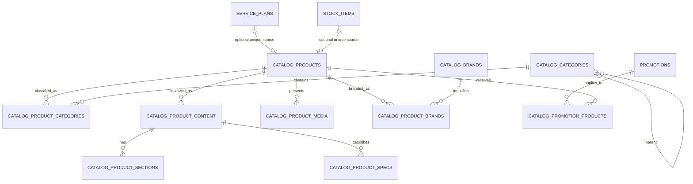

# Telecom Boss Architecture

## Catalog V2 Purpose

Catalog V2 is the product-publication layer used by the public website and its administration UI. It is additive to the existing `telecom_boss` operational schema:

- Plans, price periods and plan promotions remain authoritative in `service_plans`, `plan_prices`, `promotions` and `promotion_plans`.
- Physical product identity, selling price and stock remain authoritative in `stock_items` and the inventory ledger.
- Orders, subscriptions, invoices and historical price snapshots are not changed by Catalog V2.
- Catalog V2 owns presentation state: classification, public content, sections, media, specifications, brands, ordering and publication windows.

The design references the CSMU `project_db` four-level navigation and project/content model, plus the draft `yankees_service_cms` product tables. Those sources are semantic references only; their nullable keys, incomplete tables and fixed duplicated navigation structure are not copied.

## Relationship Model

## CSMU Crosswalk

| CSMU reference | Catalog V2 target | Design change |
|---|---|---|
| `project_cate_nav1` through `project_small_nav4` | `catalog_categories` | One self-referencing tree with database-enforced maximum depth four and cycle prevention |
| `project_master` / `product_master` | `catalog_products` | Stable code/slug, publication lifecycle and an exclusive link to a plan, stock item or no operational source |
| `project_content` / `product_description` / `product_overview` | `catalog_product_content`, `catalog_product_sections` | Localized content plus ordered structured plain-text sections |
| `product_pic` | `catalog_product_media` | Same-origin or HTTPS image URLs, required alt text and one primary image maximum |
| `product_spec` | `catalog_product_specs` | One structured row per locale and specification key; no arbitrary JSON |
| `product_brand`, `product_brand_map` | `catalog_brands`, `catalog_product_brands` | Normalized reusable brand master and many-to-many mapping |
| Legacy plan-only promotion relation | `catalog_promotion_products` | General product promotion mapping while retaining `promotion_plans` as the existing plan authority |

## Table Contract

Catalog V2 migration version 2 adds exactly ten `STRICT` tables:

1. `catalog_categories`
2. `catalog_products`
3. `catalog_product_categories`
4. `catalog_product_content`
5. `catalog_product_sections`
6. `catalog_product_media`
7. `catalog_product_specs`
8. `catalog_brands`
9. `catalog_product_brands`
10. `catalog_promotion_products`

Key invariants:

- Category codes and slugs are globally unique. Parent changes reject cycles and any resulting tree deeper than four levels.
- Product codes and slugs are globally unique.
- A `SERVICE_PLAN` product has exactly one `service_plan_id`; a `STOCK_ITEM` product has exactly one `stock_item_id`; a `GENERAL` product has neither. Source links are unique.
- Publication status is `DRAFT`, `SCHEDULED`, `PUBLISHED` or `ARCHIVED`. Scheduled rows require a valid UTC `publish_from`; bounded windows require `publish_from < publish_until`.
- Product/category, product/brand and promotion/product relations use composite primary keys.
- Partial unique indexes allow at most one primary category, image and brand per product.
- Localized content is unique by `(product_id, locale)`. Sections and specifications reference that exact content locale.
- Media permits only relative same-origin paths or HTTPS URLs and requires readable alternative text.
- Foreign keys use `RESTRICT` for operational sources and protected taxonomy/brand masters; owned publication children use `CASCADE`.
- Public listing indexes begin with the equality/filter fields used for status, parent, locale or relation lookup, followed by sort fields.

## Migration and Recovery

- Version 1 remains `create_telecom_schema`.
- Version 2 is `create_catalog_v2_schema`.
- A missing database is created at version 1 and upgraded to the current version in the same setup run.
- An existing database requires a new verified backup path before pending versions run.
- The runner checkpoints WAL, obtains a write transaction, verifies an exact SHA-256 backup and records the migration version in the same transaction as the schema change.
- The version 2 down migration drops Catalog V2 children before parents and leaves every legacy table, row and migration version 1 intact.
- Every apply and rollback ends with `PRAGMA integrity_check` and `PRAGMA foreign_key_check`.

This migration has no remote connection and does not change CSMU metadata. Any later CSMU synchronization remains a separately approved Task 33 operation.

本機可審核的 CSMU 相容匯出、crosswalk 與遠端同步核准門檻，請見 [csmu-catalog-export.md](csmu-catalog-export.md)。
